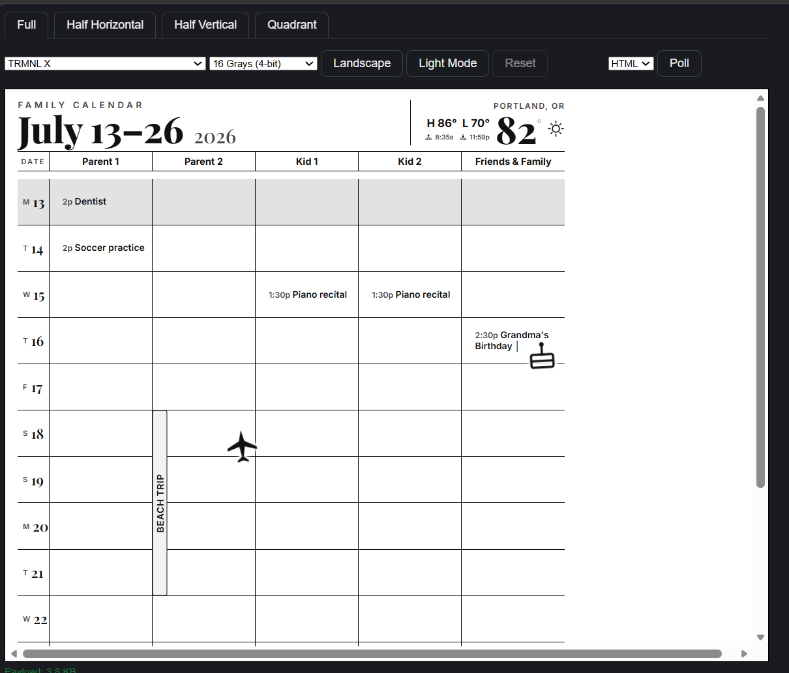

# Family Calendar for TRMNL

A 14-day, multi-person family calendar for the [TRMNL](https://usetrmnl.com)
e-ink display (designed for **TRMNL X, portrait**). One Google Calendar (or
several) in, a clean printed-looking weekly grid out — one column per family
member, with weather, US holidays, birthdays, and multi-day trips called out
automatically.



## Features

- **Rolling 14-day view** starting today, with a full-width band whenever the
  window crosses into a new month.
- **Per-person columns**, two ways to route events into them (mix and match):
  - **Tag mode** — one shared calendar, title-prefix tags like `IL: Dentist`
    route events to a column. Good when one person owns the calendar and
    others (e.g. kids) don't have their own accounts.
  - **Multi-feed mode** — a dedicated calendar per person, merged together.
    No tagging needed. Good for roommates or co-parents who each keep their
    own calendar.
- **Multi-day events** collapse into a single spanning bar instead of
  repeating on every day, labeled `(2/5)` etc.
- **US public holidays** as a full-width banner (configurable/optional —
  works with any region's public holiday calendar, or can be turned off).
- **Weather**: live current temperature, daily high/low, computed
  sunrise/sunset. Auto-selects NWS (US) or Open-Meteo (everywhere else);
  degrades gracefully to "weather unavailable" rather than breaking the
  render if a provider is down.
- **Automatic icons/stickers** for birthdays, anniversaries, trips, and
  common holidays, hand-placed with a bit of jitter so it doesn't look
  machine-generated.

## How it works

```
Google Calendar(s) (secret iCal URL)  →  Val Town middleware (src/main.ts)
   →  JSON  →  TRMNL private plugin (src/full.liquid)  →  e-ink display
```

You deploy `src/main.ts` as a small serverless function on
[Val Town](https://val.town) (free tier is enough). It fetches your
calendar(s), builds the 14-day grid + weather as JSON, and TRMNL polls it on
a schedule. Nothing about your family — names, calendar URL, location — lives
in this repo; it's all environment variables you set on your own Val Town
deployment.

## Get started

- **[SETUP.md](SETUP.md)** — deploy your own copy, step by step (Val Town,
  env vars, TRMNL plugin creation).
- **[USER-GUIDE.md](USER-GUIDE.md)** — a short, non-technical cheat sheet for
  family members adding events (tagging rules).
- **[SUBMITTING.md](SUBMITTING.md)** — how to publish this (or your own fork)
  as a TRMNL Recipe and/or share it on GitHub.

## License

MIT — see [LICENSE](LICENSE). Fork it, theme it, make it yours.
